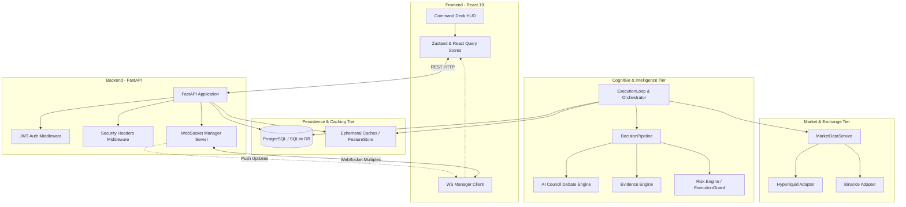
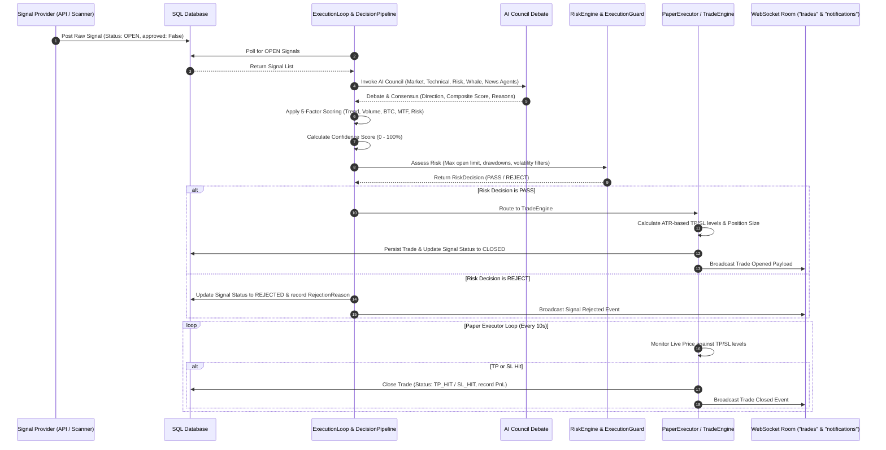

# Chapter 02: System Architecture

## 🌐 Macro-Scale System Topology
NEXUS is designed as a decoupled, high-throughput, dual-layer system featuring a **Python FastAPI backend** and a **React 19 single-page-application frontend**. Real-time bi-directional messaging is maintained via multiplexed **WebSockets**, enabling instantaneous delivery of market telemetry, risk metrics, and order updates to the UI.

The platform's logical architecture consists of three distinct horizontal tiers:
1. **Telemetry & Data Collection Tier**: Polls live exchange adapters, normalizes data feeds (funding rates, open interest, order book depth, OHLCV candles), and populates cache layers and databases.
2. **Cognitive & Decision Tier**: Orchestrates multiple specialized AI agents, runs them through debate loops, evaluates signals via a multi-component scoring pipeline, and performs real-time risk checks.
3. **Execution & Simulation Tier**: Manages the life cycle of paper trades, orders, and positions, applying rigorous automated stop-loss (SL) and take-profit (TP) monitoring.

---

## 📊 System Topology Diagram

---

## 🔄 End-to-End Decision & Signal Lifecycle

The lifecycle of a signal is executed through a highly structured, step-by-step pipeline. The following sequence diagram illustrates how a raw signal gets processed, debated by the AI Council, evaluated by the risk engines, executed, and monitored:

---

## 🏛️ System Core Modules & Boundary Mapping

| Subsystem Module | Boundary & Namespace | Primary Location | Key Collaborators |
|------------------|----------------------|------------------|-------------------|
| **API Gateway** | `api` | `api/main.py`, `api/routes/` | `auth/`, `monitoring/` |
| **Real-time Engine** | `api.websocket` | `api/websocket/` | `notifications/` |
| **Orchestrator** | `core` / `execution` | `execution/execution_loop.py` | `database.py`, `scoring/`, `risk/` |
| **AI Council** | `council` | `council/` | `services/ai/` |
| **Explanation Engine**| `decision` | `decision/` | `database.py`, `services/` |
| **Evidence & Trace** | `decision.evidence` | `decision/evidence/` | `database.py`, `services/` |
| **Market Intelligence**| `market` | `market/` | `exchange/` |
| **Trade Execution** | `execution` | `execution/trade_engine.py` | `database.py` |
| **Risk Guards** | `risk` / `scoring` | `risk/execution_guard.py` | `scoring/risk_engine.py` |
| **Portfolio & KPI** | `portfolio` / `perf` | `portfolio_engine.py`, `performance_engine.py` | `database.py` |
