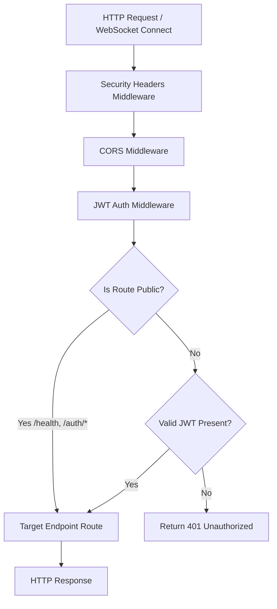

# Chapter 04: Backend Architecture

## 🚀 FastAPI Core Engine
NEXUS uses a high-performance **FastAPI** application as its main server framework, structured under `api/main.py`. FastAPI was chosen for its native support of standard asynchronous operations, Python type hinting, and rapid, typed documentation (OpenAPI).

### Key Responsibilities:
- Managing server lifespan and initializing critical resources (databases, background polling loops).
- Registering global HTTP middleware intercepts (Security Headers, CORS, JWT Authentication, logging).
- Serving as the central registry for over 31 distinct routing modules.
- Handling unhandled exceptions and validation errors uniformly.

---

## 🛡️ Router Registration & Global Middleware Pipeline

Every incoming request passes through a strict sequential middleware stack before striking any business logic:



### Registered Middlewares (`api/middleware.py` & `api/main.py`):
1. **Security Headers Middleware**: Appends standard security protections on every response:
   - `X-Content-Type-Options: nosniff` (prevents MIME sniffing).
   - `X-Frame-Options: DENY` (mitigates clickjacking).
   - `X-XSS-Protection: 1; mode=block` (mitigates basic cross-site scripting).
   - `Referrer-Policy: strict-origin-when-cross-origin`.
   - `Permissions-Policy: geolocation=(), microphone=(), camera=()`.
   - `Strict-Transport-Security` (HSTS) max-age of 1 year, applied when `API_ENV == "production"`.
2. **CORS Middleware**: Evaluates origins against configured environmental origins (`CORS_ORIGINS` in `config.py`).
3. **JWT Authentication Middleware**: Implements a strict **Default-Deny** policy. Only a designated list of routes is bypassed: `/health`, `/auth/register`, `/auth/login`, and `/api/v1/auth/*` routing modules. All other REST paths require a valid `Authorization: Bearer <JWT>` header. If the signature is invalid or missing, a `401 Unauthorized` is instantly returned.

---

## ⚠️ Global Error Intelligence & Exception Handlers

NEXUS contains built-in diagnostic safety nets within `api/main.py` to prevent stack trace leaks while generating precise, trace-auditable errors:

### 1. Request Validation Handler (`RequestValidationError`)
- When incoming JSON payloads violate the Pydantic schema or type definitions, this handler captures the error.
- Logs a warning with the offending request path, body parameters, and validation details.
- Returns a structured `422 Unprocessable Entity` JSON response containing the exact parameters that failed parsing, accompanied by a unique `request_id`.

### 2. Global Exception Handler (`Exception`)
- Acts as a catch-all for any unhandled core/routing error.
- Generates a unique, ephemeral `request_id` and registers it onto the logging thread.
- Logs the full traceback with high severity (`logger.exception`) inside `error.log`.
- Returns a clean, sanitised `500 Internal Server Error` response back to the client:
  ```json
  {
    "detail": "Internal server error",
    "request_id": "01H2Z..."
  }
  ```
  This ensures that database connection parameters, code paths, and inner memory offsets are never leaked in production.
- Appends the custom `X-Request-ID` header directly onto the response for rapid debugging.
