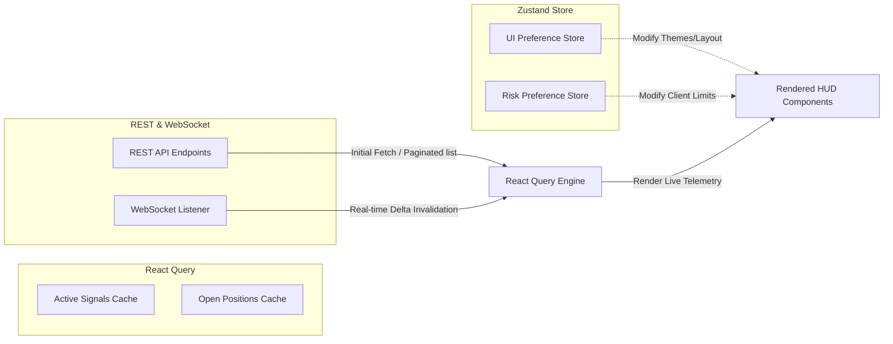

# Chapter 05: Frontend Architecture

## 🖥️ Modern React 19 + Vite 8 SPA Foundation
The NEXUS frontend is a modern, high-density Single Page Application (SPA) built with **React 19**, **TypeScript** (strict mode), and **Vite 8** for rapid hot module reloading and optimized production bundles.

The frontend is styled in an immersive **dark HUD theme** using CSS variables and tailwind configurations, optimizing information density for institutional traders who operate with multi-monitor workspaces.

---

## 🗺️ Component Hierarchy & Page Map
The frontend splits visual elements into distinct layers: **Pages** (complete lazy-loaded routed workspaces), **Widgets** (logical self-contained telemetry cards), and **Components** (reusable UI building blocks).

Below is the macro-scale routing and component mapping within `frontend/src/`:

```
App.tsx (Theme & Auth Providers)
  └── Layout (Navigation Header + Sidebar + Network Status HUD)
        ├── /command-deck          --> CommandDeck.tsx (Main dashboard, 9 widgets)
        ├── /scanner               --> Scanner.tsx (Multi-timeframe technical scans)
        ├── /decision-center       --> DecisionCenter.tsx (Log + Interactive Replays)
        ├── /journal               --> Journal.tsx (Trade review, discipline scoring)
        ├── /portfolio             --> Portfolio.tsx (Sharpe, drawdowns, equity curve)
        ├── /terminal              --> Terminal.tsx (TradingView Chart + Active Order Desk)
        └── /preferences           --> Preferences.tsx (Risk settings & custom layouts)
```

### Core UI Widgets Map (Mounted in `CommandDeck.tsx`):
1. `FounderMorningBrief.tsx`: Aggregates overnight metrics, AI Council consensus summary, and OLLO briefing.
2. `PortfolioSummaryWidget.tsx`: Dynamic displays of real-time Sharpe ratio, win-rates, open margins, and balance.
3. `RiskAlerts.tsx`: Interactive alarms for extreme volatility, leverage, and drawdown triggers.
4. `AICouncilWidget.tsx`: Live-updating carousel displaying agent consensus, individual agent logs, and debates.
5. `WatchlistWidget.tsx`: Interactive table of tracked digital assets with real-time price updates.
6. `AIDecisionTimeline.tsx`: Vertical stepping timeline charting active signals, debate sequences, and results.
7. `ActionCenter.tsx`: Highlighted, context-aware action triggers mapped to daily briefs.
8. `QuickActionsWidget.tsx`: Instant buttons to paper-close all positions or trigger manual overrides.

---

## 💾 Client-State and Server-State Synchronization Architecture

NEXUS decouples local user interface configuration states from backend transactional database states using a highly optimized dual-store approach:



### 1. Client-Side State: Zustand Stores (`frontend/src/stores/`)
- Minimalist, boilerplate-free state machines.
- **UI Store**: Manages sidebar visibility, active widgets grid configuration, dark-mode variations, and tab states.
- **Preferences Store**: Manages local formatting, date formats, and client-side risk parameter boundaries.

### 2. Server-Side State: React Query (TanStack Query) (`frontend/src/hooks/`)
- Manages caching, stale-while-revalidate policies, and automated backend polling.
- **Caching Rules**: Standard GET queries feature a `staleTime` of 10 seconds.
- **WebSocket Invalidation**: Instead of complex local list splicing, when a WebSocket broadcast is received (e.g., `trade_opened` or `trade_closed` events), React Query triggers a targeted cache invalidation (`queryClient.invalidateQueries(["positions"])`), fetching fresh, clean, and database-grounded state instantly. This avoids state drift between client UI and actual database state.

---

## 📈 TradingView Lightweight Charts Integration
The pro trading workspace (`Terminal.tsx`) implements the custom TradingView chart widget.
- **Theme Synchronization**: The chart reads Tailwind styling variables dynamically, automatically shifting grid lines, background fills, and font styling to match the primary dark HUD theme.
- **Crosshair & Layout Sync**: Supports multi-chart layouts (split panels) with unified cursor track and timeframe sync.
- **Technical Indicators**: Pipes normalized indicator profiles (EMA, RSI, MACD, ATR) directly from the backend data services to plot them over the TradingView workspace.
