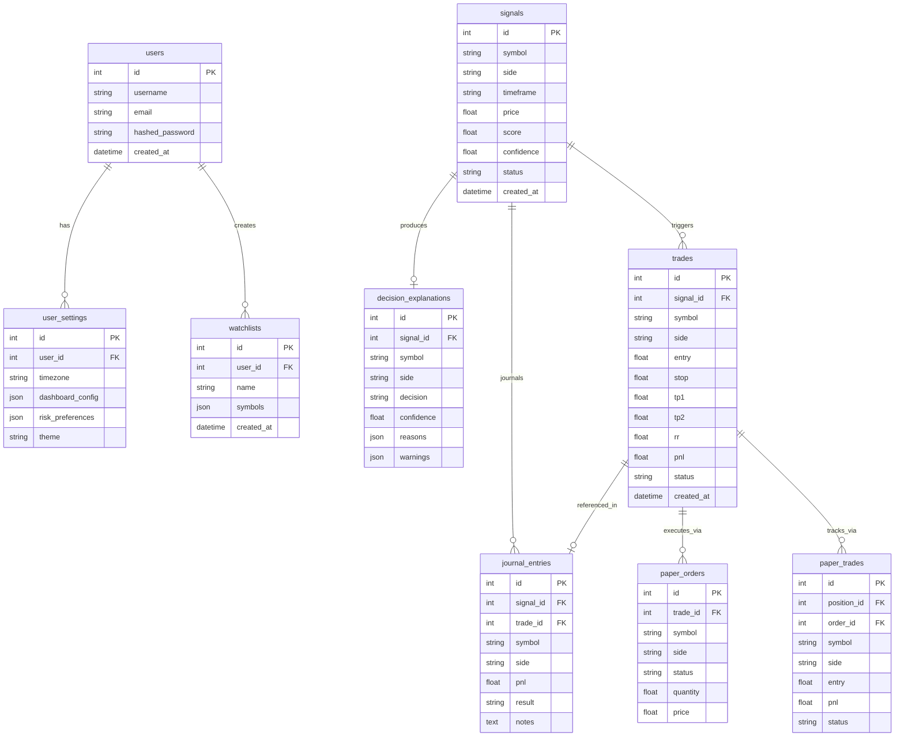

# Chapter 06: Database Architecture

## 🗄️ SQLAlchemy Configuration & Database Engine
NEXUS uses a declarative object-relational mapping (ORM) layer structured under `database.py` utilizing **SQLAlchemy**. The database configures dynamically depending on the current runtime environment:
- **Production environment**: Connects to **PostgreSQL 16** via a robust connection pool.
- **Development & Test environments**: Connects to **SQLite**, allowing fast, isolated, and local setup without heavyweight external dependencies.

---

## 🗺️ Entity-Relationship (ER) Diagram

The relationships among database tables are modeled below. Although SQLite runs as an in-memory or single-file storage with some loose enforcement, the logical connections are strictly maintained at the query and transaction layers:

---

## 💾 Core Database Models Specification

### 1. `Signal` Table
Holds raw, system-ingested strategy alerts which must be scored and analyzed by the decision pipeline.
- `id` (Integer, Primary Key, Indexed)
- `symbol` (String(20), Indexed) - e.g., "BTC", "ETH"
- `side` (String(10)) - "LONG" or "SHORT"
- `price` (Float) - Alert entry price
- `score` (Float) - Aggregate weighted factor score (0.0 to 1.0)
- `confidence` (Float) - Decision confidence percentage (0.0 to 100.0)
- `status` (String(30)) - State of the signal: `"OPEN"`, `"APPROVED"`, `"REJECTED"`, `"CLOSED"`
- `created_at` (DateTime, Server Default: `now()`)

### 2. `Trade` Table
Tracks standard positions generated from approved and validated signals.
- `id` (Integer, Primary Key, Indexed)
- `signal_id` (Integer) - ID of the originating signal
- `symbol` (String(20))
- `side` (String(10))
- `entry` (Float) - Realized average entry price
- `stop` (Float) - Hard Stop Loss price
- `tp1` / `tp2` (Float) - First and second Take Profit price targets
- `rr` (Float) - Risk-to-Reward ratio
- `pnl` (Float) - Realized or unrealized profit/loss
- `status` (String(30)) - Current position state: `"OPEN"`, `"CLOSED"`, `"TP_HIT"`, `"SL_HIT"`

### 3. `DecisionExplanation` Table
Maintains natural-language explanations, agent scores, and diagnostic snapshots of portfolio health.
- `id` (Integer, Primary Key, Indexed)
- `signal_id` (Integer, Indexed)
- `decision` (String(10)) - `"APPROVE"` or `"REJECT"`
- `confidence` (Float)
- `reasons` / `warnings` / `supporting_signals` / `risk_notes` (JSON lists of string descriptors)
- `technical_score` / `whale_score` / `news_score` / `risk_score` / `trend_score` (Individual agent metrics)

### 4. `JournalEntry` Table
Enables structured qualitative reviews for daily trading performance analysis.
- `id` (Integer, Primary Key, Indexed)
- `symbol` (String(20))
- `side` (String(10))
- `pnl` (Float)
- `result` (String(20)) - `"WIN"`, `"LOSS"`, `"PENDING"`
- `notes` (Text) - User-typed emotional/discipline notes

---

## ⚡ Performance Optimization & Caching Strategies

To satisfy the demanding low-latency query requirements of high-density financial HUD interfaces, NEXUS implements explicit indexing and memory caching schemes:

### 1. Database Schema Indexing
High-traffic telemetry fields and columns frequently evaluated in filter queries are explicitly indexed in `database.py`:
- `Signal.status`, `Signal.created_at`
- `Trade.status`, `Trade.symbol`, `Trade.created_at`
- `Notification.read`, `Notification.created_at`

### 2. Bounded Capacity In-Memory Caches
NEXUS uses bounded-capacity in-memory caches to prevent performance degradation over time:
- **`DashboardCache`**: Limits memory allocation to **1000 items** with a first-in-first-out (FIFO) eviction strategy.
- **`FeatureStore`**: Implements a strict cap of **5000 items** to ensure historical price metrics do not lead to memory pressure.
- **`TradeMemory` Cache**: Restricts records to **500 items**, preventing unbounded RAM inflation during intensive execution simulation runs.
- These memory limits prevent performance degradation even with thousands of simulated trade ticks per session.
