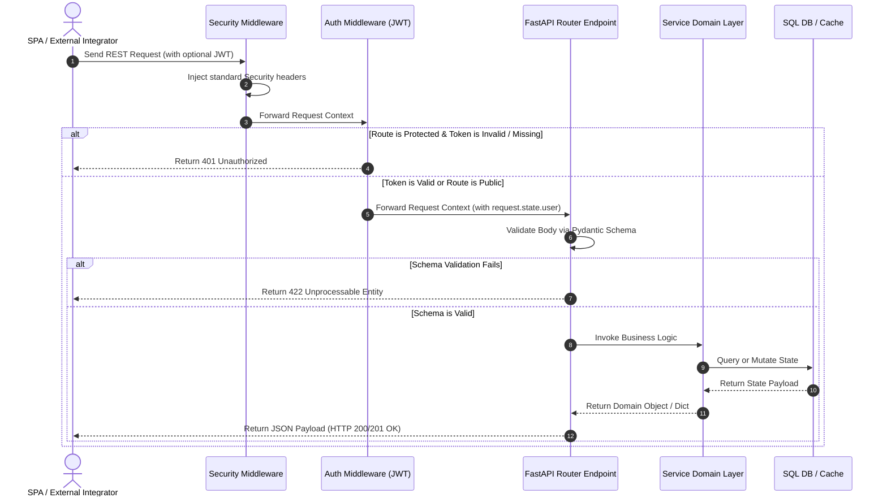

# Chapter 07: API Reference

## 🧭 REST API Structure & Schema Overview
All RESTful interactions in NEXUS are structured around clean, predictable HTTP operations. Standard endpoints consume and yield JSON payloads validated via **Pydantic** models (found under `dto/` and inline route files).

---

## 🔑 Primary REST API Routes Catalog

### 1. Authentication (`api/routes/auth.py`)
- `POST /auth/register`
  - **Payload**: `{ "username": "...", "email": "...", "password": "..." }`
  - **Response**: `{ "id": 1, "username": "...", "email": "..." }`
- `POST /auth/login`
  - **Payload**: `{ "username": "...", "password": "..." }`
  - **Response**: `{ "access_token": "...", "token_type": "bearer" }`

### 2. Trading Signals (`api/routes/signals.py`)
- `GET /api/v1/signals`
  - **Queries**: `status` (optional), `limit` (optional, default: 50)
  - **Response**: `{ "total": 5, "signals": [ ... ] }`
- `POST /api/v1/signals`
  - **Payload**: `{ "symbol": "BTC", "side": "LONG", "price": 64200.0, ... }`
  - **Response**: Full created `Signal` object.

### 3. Execution & Paper Trading (`api/routes/paper.py` & `api/routes/paper_trading.py`)
These routers expose the endpoints of the paper simulation workspace.
- `GET /paper/orders` - Lists active and filled paper orders.
- `GET /paper/trades` - Lists active and closed paper trades.
- `GET /paper/positions` - Aggregates open simulated positions.
- `GET /paper/summary` - Provides a complete nested overview of paper metrics:
  ```json
  {
    "orders": { "total": 3, "filled": 2, "pending": 1, "cancelled": 0 },
    "trades": { "total": 2, "open": 1, "pnl": 50.0 },
    "positions": { "total": 1 }
  }
  ```

### 4. Decision Explanations (`api/routes/explanation.py`)
- `GET /api/v1/explanations/{signal_id}`
  - **Response**: Detailed decision factors, risk notes, and supporting data:
    ```json
    {
      "signal_id": 102,
      "decision": "APPROVE",
      "confidence": 84.5,
      "reasons": ["Bullish trend alignment", "Extreme whale CVD accumulation"],
      "warnings": ["High short-term RSI levels"],
      "risk_notes": ["Position sizes reduced by 25% due to asset volatility"]
    }
    ```

### 5. Risk Diagnostics (`api/routes/risk.py`)
- `GET /api/v1/risk/status`
  - **Response**: Pre-flight status and evaluation limits:
    ```json
    {
      "risk_score": 35.0,
      "open_trades": 1,
      "max_open_trades": 3,
      "daily_loss": 0.0,
      "max_daily_loss": 10000.0,
      "system_status": "NORMAL"
    }
    ```

### 6. KPI, Analytics & Widgets (`api/routes/widgets.py` & `api/routes/kpi.py`)
- `GET /api/v1/widgets/{widget_type}`
  - **Types**: `"kpi"`, `"portfolio"`, `"monitoring"`, `"explanation"`, `"timeline"`, `"notifications"`
  - **Response**: Clean, structured dashboard configurations optimized for frontend widgets. Unused routing parameters (like limit) are dynamically swallowed via `**kwargs` inside the underlying `WidgetService` routines to ensure API stability.
- `GET /api/v1/kpi/summary`
  - **Response**: Key performance trackers: Sharpe ratio, win rate, total closed positions, and equity.

---

## 📈 Request-Response Lifecycle
The lifecycle of a typical request through the API is detailed below:


