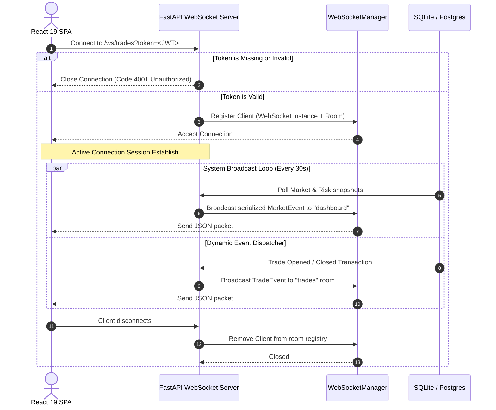

# Chapter 08: WebSocket Architecture

## 📡 Real-Time WebSocket Core
The NEXUS real-time subsystem under `api/websocket/manager.py` enables low-latency bi-directional data flow. Real-time notifications, trading metrics, and order updates are immediately pushed to client browsers, minimizing rendering delays and avoiding polling bottlenecks on high-density widgets.

---

## 🔒 Connection Lifecycle & Token Authentication

To secure real-time metrics, WebSocket endpoints implement an explicit connection validation handshake:

### Authentication Details:
- When connecting to a room (e.g., `/ws/trades`, `/ws/notifications`), the client must pass the valid JSON Web Token as a query parameter: `?token=<JWT>`.
- The endpoint decodes and validates the signature using the configured HS256 secret.
- If validation fails, the server closes the connection immediately with a specific close code (e.g., `4001`), preventing unauthenticated sockets from consuming memory or sniffing stream metrics.

---

## 🚪 Specialized Rooms & Multiplex Channels
The system implements separation of concerns by multiplexing WebSocket connections into distinct rooms inside `api/main.py`:

| Room Name | API Endpoint | Associated Frontend Page | Primary Data Schema |
|-----------|--------------|--------------------------|---------------------|
| **trades** | `/ws/trades` | CommandDeck, Terminal | Trades opened, closed, margins, entry |
| **analytics** | `/ws/analytics` | Portfolio, Personal Insights | Portfolio equity curve updates |
| **dashboard** | `/ws/dashboard` | CommandDeck HUD | Market regimes, price, volatility index |
| **portfolio** | `/ws/portfolio` | Portfolio | Active open balances, realized margins |
| **notifications**| `/ws/notifications`| Global Notifications HUD | Actionable trade alerts, risk alarms |
| **scanner** | `/ws/scanner` | Scanner | Active technical breakout signals |

---

## 🔄 Periodic Broadcast Loop & State Delta Pushes
While transactional actions (like opening or closing a simulated position) trigger immediate event-driven broadcasts, NEXUS also implements a background scheduled broadcast loop (`_periodic_broadcast` inside `api/main.py`) to keep the user interface refreshed:
- Runs continuously on a **30-second interval** as a decoupled FastAPI lifespan task.
- **Market Broadcaster (`_broadcast_market`)**: Pulls fresh pricing and indicator snapshots for index assets (e.g., BTC) via the `MarketDataService`. Translates raw indicators (EMA metrics, RSI, volatility, average ATR) and classifies the current market structure via the `RegimeAI` engine. Broadcasts a serialized `MarketEvent` and `PriceUpdateEvent` to the `"dashboard"` room.
- **Risk Broadcaster (`_broadcast_risk`)**: Polls the database to aggregate open and closed simulated positions. Invokes the `RiskEngine` to compute an aggregate risk score. Broadcasts a serialized `RiskEvent` payload to the `"notifications"` and `"dashboard"` rooms to keep HUD indicators aligned.
