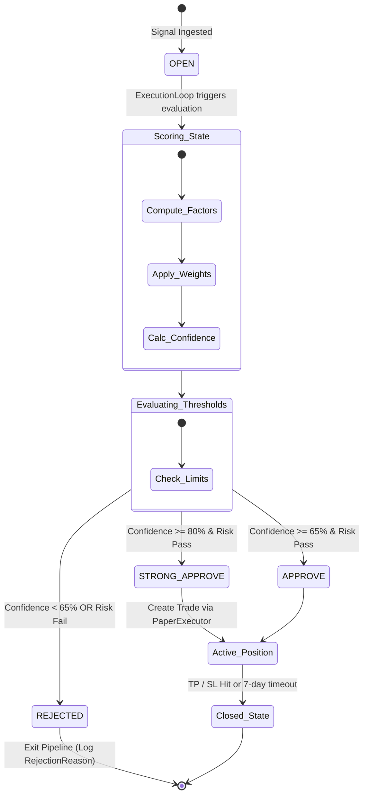

# Chapter 09: AI Decision Engine

## ⚙️ Core Signal Ingestion & Scoring Pipeline
At the core of the NEXUS decision-support ecosystem is the **Decision Pipeline**, structured under `execution/pipeline.py` and `scoring/scoring_engine.py`. This system takes raw incoming trading alerts and processes them through a multi-stage technical and cognitive analysis pipeline.

The scoring system uses a **5-factor weighted algorithm** where factor weights are strongly-typed and validated. The aggregate score must fall within the range `[0.0, 1.0]`.

---

## 🎚️ 5-Factor Scoring Model Specifications
The scoring process is handled inside `scoring/scoring_engine.py` by evaluating five distinct market dimensions:

| Component Factor | Weight | Evaluation Method & Logic | Related Code / Indicators |
|------------------|--------|----------------------------|----------------------------|
| **Trend Factor** | 0.30 | Matches direction against multi-timeframe EMA lines (EMA 20, 50, 200). A perfect bullish score is achieved when `Close > EMA20 > EMA50 > EMA200`. | `scoring/scoring_engine.py` |
| **Volume Factor**| 0.20 | Analyzes the relative volume of the alert candle against its historical moving average volume. Boosts score when significant volume supports a breakout. | `market_data/volume.py` |
| **BTC Health** | 0.20 | Assesses BTC trend alignment. Long signals are penalized and short signals are supported if BTC exhibits bearish macro structures. | `filters/btc_filter.py` |
| **Multi-Timeframe**| 0.15| Cross-references technical indicators (RSI divergence, MACD crossovers) across 15m, 1h, and 4h panels to confirm momentum. | `market_data/mtf.py` |
| **Risk Score** | 0.15 | Penalizes signals with excessive asset volatility (e.g. extremely wide ATR levels) or poor risk-to-reward ratios. | `scoring/risk_engine.py` |

---

## 📐 Confidence Calculation Math

Once individual factor scores are computed, the `ConfidenceEngine` (`core/confidence_engine.py`) determines the aggregate confidence score.

### Mathematical Formula:
$$\text{Confidence} = \sum_{i=1}^{5} (W_i \times S_i) \times 100$$

Where $W_i$ is the configured factor weight and $S_i$ is the computed factor score (0.0 to 1.0).

---

## 🚦 System Approve/Reject Thresholds & State Machine

Depending on the calculated score and confidence level, the system assigns a strict status classification to the signal:

- **`STRONG_APPROVE` (Confidence $\ge 80\%$)**: Fully validated signal. Triggers automated position sizing with standard risk allocations.
- **`APPROVE` (Confidence $65\% \le C < 80\%$)**: Marginally passing signal. Triggers trade creation but applies position size reduction factors (e.g., 50% exposure scaling) as a safety precaution.
- **`REJECT` (Confidence $< 65\%$)**: Fails to meet the confidence threshold. Signal status is set to `REJECTED`, and the evaluation factors are archived in the database for future strategy analysis.
- *Note: A known limitation (BP2) exists where a double-scaling math bug in the underlying ConfidenceEngine causes every evaluated signal to return STRONG_APPROVE, which is flagged for immediate correction in Sprint 24.*
