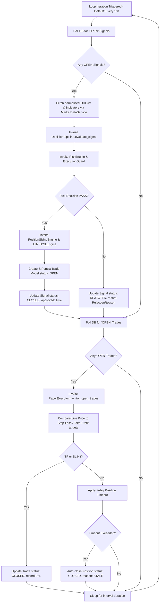

# Chapter 10: Orchestrator

## ⚙️ The ExecutionLoop Core Coordinator
The operational heartbeat of the NEXUS decision pipeline is the **Execution Loop**, located at `execution/execution_loop.py`. The Execution Loop is an automated background scheduler that coordinates data flow across the entire platform.

### Key Responsibilities:
- Continuously polling the database for raw signals with a status of `"OPEN"`.
- Intercepting active positions to trigger price-monitoring tick loops.
- Driving execution and clearing stale transactions.

---

## 🔁 Continuous Polling & Batch Processing Cycles

The loop operates as a stateful, recurring batch cycle. Below is the internal flow of an `ExecutionLoop` iteration:

### Core Execution Parameters (Configured in `config.py` & `.env`):
- **`POLLING_INTERVAL`**: Defaults to **10 seconds**. Controls how frequently the loop scans for raw signal arrivals and ticks paper positions.
- **`STALE_TRADE_TIMEOUT`**: Defaults to **7 days** (`604800` seconds). Positions open for longer than this duration are automatically liquidated by the engine to free up portfolio capital.
- **`MAX_OPEN_TRADES`**: Defaults to **3**. Dictates the maximum capacity of concurrent active trades the orchestrator can manage.
