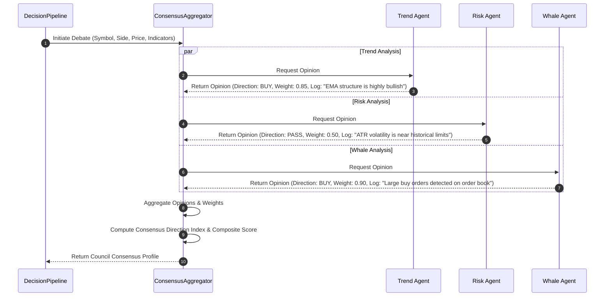

# Chapter 11: AI Council

## 🧠 Specialized Multi-Agent Collective
NEXUS implements a **Specialized Multi-Agent Collective** (the AI Council) structured under `council/`. Instead of relying on a single, general-purpose LLM to make trading decisions, the platform distributes analysis across several virtual experts. Each agent is modeled with distinct risk tolerances, market metrics focus, and cognitive biases.

This approach ensures that recommendations are thoroughly stress-tested through a structured debate before they are presented to the human operator on the HUD layout (`AICouncilWidget.tsx`).

---

## 🎭 Specialized Cognitive Agent Personas

The council consists of five core agents, each operating with clear analytical responsibilities:

### 1. Trend Agent (`council/trend_agent.py`)
- **Primary Focus**: Market momentum, macro trend lines, and exponential moving average (EMA) structures.
- **Biases**: Tends to be overly bullish in trending markets (FOMO) and highly risk-averse in ranging, volatile structures.

### 2. Technical Agent (`council/technical_agent.py`)
- **Primary Focus**: Micro indicators (Relative Strength Index, MACD lines, Bollinger Band contractions, Stochastic oscillators).
- **Biases**: Prone to over-trading based on minor reversals, often advocating for counter-trend entries.

### 3. Risk Agent (`council/risk_agent.py`)
- **Primary Focus**: Capital preservation, historical drawdown tracking, asset volatility (ATR), and structural stop-loss feasibility.
- **Biases**: Extremely conservative. Frequently recommends rejecting long setups during periods of high market volatility.

### 4. Whale Agent (`council/whale_agent.py`)
- **Primary Focus**: Cumulative Volume Delta (CVD) divergence, order book liquidity depth, large transaction tracking, and exchange flows.
- **Biases**: Ignores traditional trend directions, focusing purely on smart money accumulation metrics.

### 5. News / Macro Agent (`council/news_agent.py` & `council/macro_agent.py`)
- **Primary Focus**: Sentiment analysis, news ingestion alerts, funding rates, open interest shifts, and macro-economic factors.
- **Biases**: Sensitive to overnight narrative swings and high funding rate friction.

---

## 🗣️ The Multi-Agent Debate & Consensus Engine

When a signal is analyzed, the Orchestrator initiates a multi-agent debate sequence managed by `council/consensus.py`:

### Consensus Calculations:
- Each agent returns a structured `AgentOpinion` payload featuring a target direction (`BUY`, `SELL`, or `PASS`), an internal confidence weight ($[0.0, 1.0]$), and a natural-language diagnostic rationale log.
- **Consensus Direction Index (CDI)**: Calculated as the weighted average of the agents' opinions. A CDI above `0.70` indicates a strong collective consensus to approve the trade, while a CDI below `0.40` triggers automated rejection.
- The compiled results (consensus score, direction, individual agent logs) are serialized and pushed directly to the UI via WebSockets, allowing the Founder to audit the reasoning of each digital analyst.
