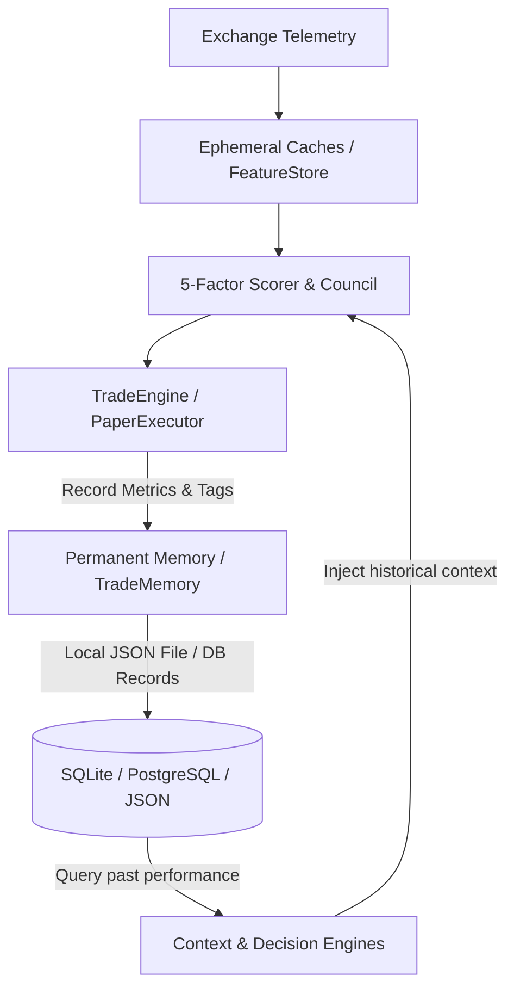

# Chapter 12: Memory System

## 💾 Permanent & Ephemeral Knowledge Layers
NEXUS uses a multi-tier memory system to ensure that historical context, execution telemetry, and cognitive patterns are preserved. Memory is separated into distinct layers to maintain low-latency query speeds while securing permanent data from system crashes.

---

## 🏗️ Memory Layer Design

### 1. Ephemeral Cache Layer (`market/cache/`)
- Handles high-frequency price updates, order book depths, and rapid indicator computations.
- Uses strict memory bounds (e.g., maximum of **1000 items** in `DashboardCache`) to prevent RAM inflation during long-running trading sessions.
- Automatically evicts old items using a first-in-first-out (FIFO) cache eviction strategy.

### 2. Trade Memory Layer (`memory/trade_memory.py`)
- Tracks past executed paper trades alongside qualitative performance tags (e.g., emotional states, market conditions, discipline scores).
- Automatically saves permanent knowledge records to a localized, structured JSON database file at `/app/nexus_permanent_memory.json` or relational database records, preserving system state during redeployments.
- Provides quantitative analytics (e.g., win rates of signals under specific market regimes) to inform the decision engines and the human operator.

---

## 📈 Closed-Loop Learning Feedback
The Trade Memory Layer acts as a closed-loop feedback engine. When a signal is processed, the system queries past trades to retrieve similar setups.

This historical context (e.g., "78% of long signals for this asset failed when RSI was above 75 under ranging structures") is injected directly into the decision engines and the AI Council, helping to calibrate confidence levels and reduce false breakouts.
