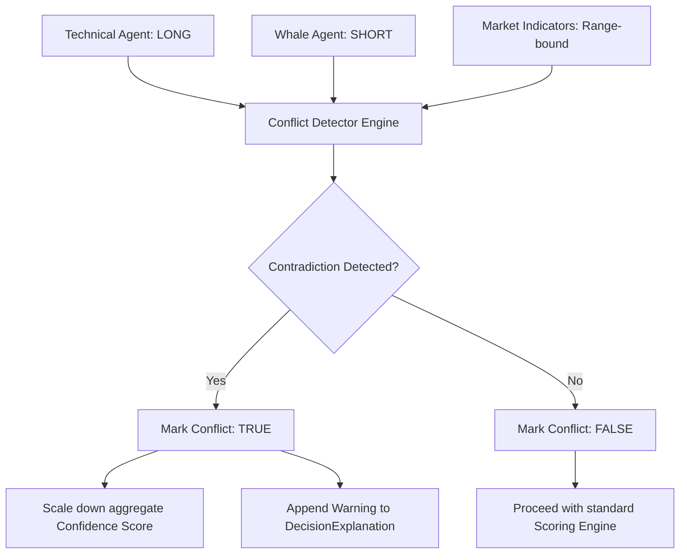

# Chapter 13: Evidence Engine

## 🏛️ Structured Cognitive Evidence Architecture
The **Evidence Engine**, located under `decision/evidence/`, provides a rigorous auditing layer for all decision-making in NEXUS. It registers, aggregates, and validates individual pieces of evidence (telemetry indicators, AI agent opinions, sentiment scores) before they are synthesized into a final signal decision.

### Key Responsibilities:
- Standardizing raw indicators and agent logs into unified `Evidence` payloads.
- Tracking the precise source and timestamp of every piece of data (trace auditability).
- Detecting logical contradictions (conflicting evidence) across different sources.

---

## 🧭 Source Trace Auditability & Registry
The Evidence Engine uses a centralized registry (`evidence_registry.py`) to manage all active evidence sources. Each registered source (e.g., `"TechnicalAgent"`, `"HyperliquidOrderBook"`, `"VolatilityEngine"`) must declare its data schema and reliability weight.

When a piece of evidence is added, the engine builds a `SourceTrace` schema, detailing:
- The originating module or API connection.
- The precise millisecond timestamp of data extraction.
- The exact inputs used to compute the metric.
- This creates an immutable audit trail for every single decision, preventing black-box recommendations and facilitating post-trade reviews.

---

## 🚦 Cognitive Conflict Detection Flow

The engine implements a specialized detector (`conflict_detector.py`) to scan for conflicting signals across different analytical categories:

### Key Conflict Detection Rules:
1. **Trend vs. Momentum Conflict**: Flagged when technical indicator oscillators (e.g., RSI overbought) strongly contradict macro trend indicators (e.g., Price > 200 EMA).
2. **Whale vs. Retail Conflict**: Flagged when CVD accumulation (smart money) is dropping rapidly while micro price action is pushing up on low volume.
3. **Volatility vs. Risk Conflict**: Flagged when extreme ATR values are recorded during a breakout signal, violating standard risk tolerance limits.
- When a conflict is detected, the engine doesn't necessarily reject the trade; instead, it automatically scales down the final confidence score and appends a clear warning to the `DecisionExplanation` model to alert the human operator.
