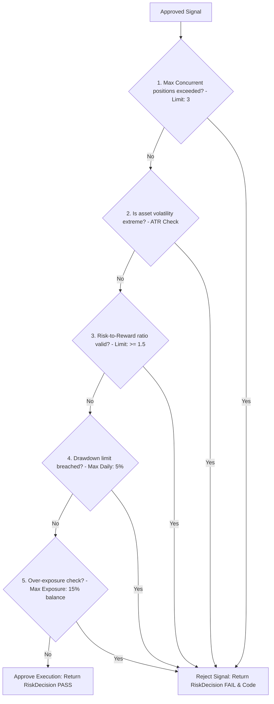

# Chapter 14: Risk Engine

## 🛡️ Capital Preservation Core
The **Risk Engine** and the **Execution Guard** (located under `scoring/risk_engine.py` and `risk/execution_guard.py`) act as the pre-flight safety backstop for all trades in NEXUS. Before any approved signal is routed to the paper trading loop or exchange engine, it must pass a battery of structural risk audits.

### Key Responsibilities:
- Standardizing risk metrics calculations across all asset classes.
- Validating positions against capital allocation limits.
- Preventing over-exposure and mitigating catastrophic drawdowns.

---

## 🚦 The 5-Rule Pre-Flight Execution Check

Every signal must satisfy five strict validation rules to be approved for execution:

### Risk Evaluation Rules Catalog:
1. **Max Concurrent Positions Check**: Validates that active open trades do not exceed the configured limit (default: **3 concurrent positions**).
2. **Extreme Volatility Guard**: Checks current ATR (Average True Range) against historical limits. If volatility is historically excessive, the trade is blocked to prevent stop-loss slippage.
3. **Risk-to-Reward (R:R) Validation**: Enforces a minimum R:R of **1.5**. If the distance to the target is too narrow relative to the stop-loss distance, execution is rejected.
4. **Drawdown Threshold Enforcement**: Monitors daily realized/unrealized loss. If total portfolio drawdown exceeds the daily safety limit (default: **5% of total equity**), the risk engine locks the system, blocking new executions.
5. **Asset-Class Exposure Limit**: Enforces a strict exposure limit per single asset class (default: **15% of total account balance**), preventing over-allocation and maintaining diversification.

---

## 🚫 Rejection Codes Specification (`risk/models.py`)
When a trade is rejected by the execution guard, it is assigned an explicit rejection code to inform the operator via the dashboard HUD UI (`RiskAlerts.tsx`):
- `EXCESSIVE_VOLATILITY`: Volatility metrics are outside acceptable trading ranges.
- `MAX_POSITIONS_EXCEEDED`: The maximum capacity of concurrent trades has been reached.
- `DAILY_LOSS_LIMIT_BREACHED`: Portfolio daily loss limits have been violated.
- `INVALID_RISK_REWARD`: The computed Risk-to-Reward ratio is below the minimum threshold.
- `OVER_EXPOSURE`: Executing the position would violate diversified allocation limits.
- `DUPLICATE_ORDER`: A paper order or active position is already open for this asset and side.
- This explicit rejection modeling prevents opaque failures and enables deterministic, trace-auditable trade auditing.
