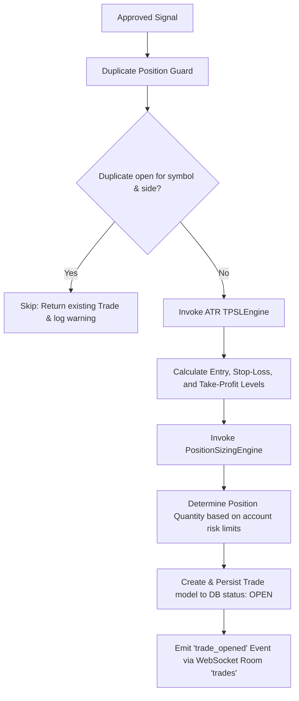

# Chapter 16: Execution Engine

## ⚙️ Active Position Management
The **Execution Engine**, structured under `execution/trade_engine.py` and `execution/tp_sl.py`, takes approved signals from the Decision Pipeline and translates them into active simulated positions.

---

## 🔁 Complete Transaction Lifecycle

The flow from an approved signal to an active position follows a strict transaction lifecycle:

### Core Execution Modules:
- **`Duplicate Position Guard`**: Prevents over-exposure by blocking duplicate open trades for the same asset and side.
- **`ATR TPSLEngine`**: Calculates technical stop-loss and take-profit targets based on the asset's underlying volatility (ATR), ensuring levels adapt dynamically to changing market regimes.
- **`PositionSizingEngine`**: Determines position sizes dynamically by scaling allocation relative to account equity, preventing excessive risk on highly volatile assets.
- **`Event Dispatcher`**: Automatically serializes and broadcasts standard trade events to registered WebSocket rooms, keeping client HUDs in sync with backend execution states.
- *Note: A known technical bug (BP3) exists where a typo in indicator calculations (`ATRr_14` instead of `ATR_14`) can lead to indicator readings reverting to zero under certain conditions, which is scheduled for immediate remediation in Sprint 24.*
