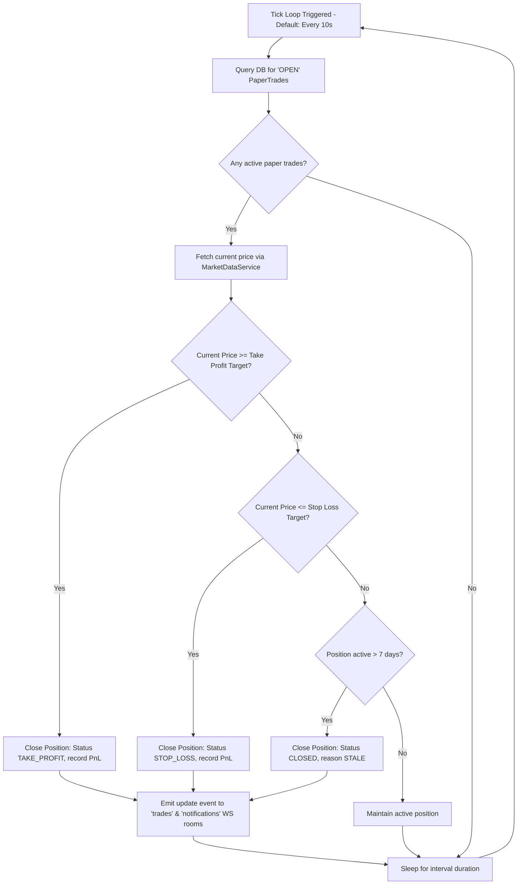

# Chapter 17: Paper Trading

## 🧪 Zero-Risk Market Simulation
The **Paper Trading Engine**, structured under `execution/paper_executor.py` and `execution/paper.py`, provides a zero-risk market simulation environment. By tracking prices and executing orders in memory, the engine allows strategies to be verified against live market conditions without committing capital.

---

## 🔁 The Ticking, Monitoring, and Liquidation Loop

The simulated trade monitoring process is executed as a recurring loop by the `PaperExecutor` class:

### Core Execution Safeguards:
- **`Volatility-Based Sizing`**: Scales risk exposures dynamically based on asset volatility (ATR) and macro market regimes, mitigating catastrophic losses on highly volatile instruments.
- **`Automated Take Profit / Stop Loss (TP/SL) Execution`**: Tracks simulated prices in real time, automatically executing stop-loss and take-profit targets to protect simulated balances.
- **`7-Day Capital Preservation Timeout`**: Automatically liquidates any open trade that remains inactive for longer than 7 days, freeing up simulated capital and preventing dead-money drag.
- **`Real-Time Event Broadcasts`**: Automatically serializes and pushes execution updates to active browser clients, keeping HUD widgets synchronized with simulated positions.
