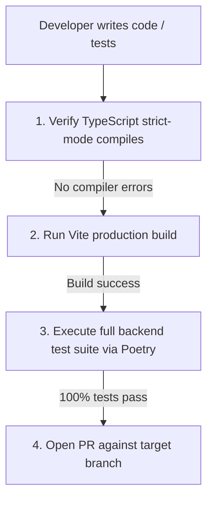

# Chapter 25: Developer Onboarding Guide

## 📌 Purpose
The **Developer Onboarding Guide** serves as the definitive reference for incoming engineers, architects, and technical contributors. Its goal is to fast-track onboarding (enabling a senior engineer to understand, run, and modify the system within one hour) while maintaining high architectural discipline, code quality, and alignment with the platform's engineering philosophy.

---

## 🛠️ Developer Responsibilities & Behavioral Principles
To preserve the integrity of the NEXUS decision platform, every developer must adhere to three core behavioral principles:
1. **Understand "Why" Before Writing Code**: Every code change must directly serve the Founder’s daily decision-support workflow. If a feature does not reduce cognitive load or improve decision quality, it does not belong in the repository.
2. **Never Commit Failing Code**: The test suite is the platform's ultimate safety guard. No commits are allowed on shared branches unless all 1,325+ tests pass successfully.
3. **Protect Architectural Boundaries**: Do not introduce direct database queries inside presentation layers or tight couplings between independent subsystems. Always respect the separation of concerns between raw telemetry, cognitive debate, and simulation execution.

---

## 🔌 System Setup & Local Environments
Setting up a new development workspace is automated and reproducible.

### 📋 Dependencies & Environmental Requirements
NEXUS requires the following baseline environment:
- **Python**: Version `3.13.x` (enforced via `pyproject.toml`).
- **Poetry**: Package dependency manager.
- **Node.js**: Version `20.x` or newer (for compiled static assets).
- **SQLite / PostgreSQL**: Local setups default to SQLite, while production environments run PostgreSQL 16.

### 🚀 Step-by-Step Workspace Initialization
Follow these commands in your local sandbox to start development:

```bash
# 1. Clone the repository and navigate to the root
cd elite-decision-engine

# 2. Configure Pyenv to use Python 3.13
pyenv local 3.13.0

# 3. Configure Poetry and install locked backend dependencies
poetry env use python3.13
poetry install --no-root

# 4. Initialize environment variables
cp .env.example .env

# 5. Create local database tables and seed mock data
poetry run python startup.py

# 6. Run the FastAPI development server
poetry run python -m uvicorn api.main:app --reload --port 8000
```

In a separate terminal window, set up the frontend:
```bash
# Navigate to the frontend workspace
cd frontend

# Install Node packages and run the Vite development server
npm install
npm run dev
```

---

## 🧪 Verification and Pull Request Compliance Workflow
Before submitting any code change for review, developers must complete the **Compliance Checklist**:



### 📋 CLI Verification Commands:
- **TypeScript & Build Verification**:
  ```bash
  cd frontend
  npm run build
  ```
  Ensure the compilation completes with **zero strict-mode errors**.
- **Backend Test Verification**:
  ```bash
  poetry run pytest
  ```
  Ensure all 1,325+ test cases pass cleanly without deprecation warnings or transactional leakage.

---

## 💥 Common Failure Modes & Troubleshooting

1. **`ModuleNotFoundError: No module named 'fastapi'`**:
   - *Cause*: Poetry environment is not activated or is pointing to the wrong Python version.
   - *Fix*: Run `poetry env info` to verify your active environment path. If pointing to Python 3.12, run `poetry env use python3.13` and re-run `poetry install`.
2. **`SAWarning: transaction already deassociated from connection`**:
   - *Cause*: A database session was closed prematurely inside a test thread while transactional rollbacks were active.
   - *Fix*: Ensure all database queries are wrapped inside the `session_scope()` context manager defined in `database.py`.
3. **WebSocket Connection Failures (Code 4001)**:
   - *Cause*: The browser client failed to append a valid token query parameter on connection.
   - *Fix*: Pass `?token=${jwtToken}` in your WebSocket connection string and ensure your local `.env` has a valid `JWT_SECRET`.

---

## 🔄 Future Extension Points
- **Automated Pre-Commit Hooks**: Future releases will implement Git hooks (`pre-commit` framework) to automate linting, formatting, and unit-test execution before commits can be completed.
- **Docker-Isolated Test Pipelines**: Migration of E2E verification suites into fully isolated ephemeral Docker environments to prevent local caching discrepancies.

---

## 🔗 Related Chapters
- [Chapter 21: Testing Methodology](21_TESTING.md) - Deep dive into test suites, mocking, and coverage.
- [Chapter 23: Operations Runbook](23_OPERATIONS_RUNBOOK.md) - Production deployment and maintenance tasks.
- [Chapter 26: Architecture Decisions](26_ARCHITECTURE_DECISIONS.md) - Context behind core design patterns.
