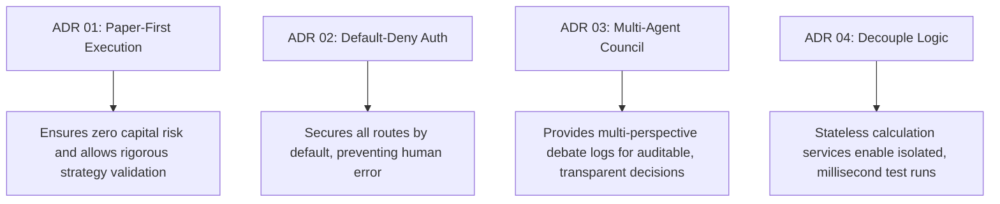

# Chapter 26: Architectural Decisions

## 📌 Purpose
The **Architecture Decisions** register (frequently termed the Architecture Decision Record, or ADR, Register) documents the historical, current, and permanent structural design patterns chosen for the NEXUS platform. This chapter details **why** these decisions were made, the alternatives considered, and the specific trade-offs accepted.

---

## 🏛️ System Core ADR Register

### ADR 01: Paper-First Execution Architecture

* **Context**: When deploying a new quantitative trading platform, engineers often rush to build live trading exchange integrations. This introduces severe regulatory and operational risks, potential capital loss due to bugs, and complex concurrency challenges in high-frequency environments.
* **Decision**: All live, real-money execution infrastructure is kept dormant. All trading signal routing and position tracking execute strictly within a simulated paper trading environment (`execution/paper_executor.py`).
* **Alternatives Considered**:
  1. *Direct Live Execution*: Rejected due to high risk of capital loss during initial Alpha/Beta testing.
  2. *Hybrid Live/Paper Execution*: Rejected due to high architectural complexity and the risk of accidental live order routing.
* **Trade-offs Accepted**:
  - *Pros*: Complete safety; allows strategies to be verified against real-world order books and volatility with zero capital risk.
  - *Cons*: Simulated PnL does not capture exchange fee structures, market impact, or order queue delays.
* **Engineering Philosophy**: Prioritize capital preservation and developer peace-of-mind over rapid, unverified execution.

---

### ADR 02: Default-Deny Authorization Middleware

* **Context**: Financial platforms handle sensitive transactional information (trades, balances, settings). Standard API development often secures routes individually, which is prone to human error—an engineer can easily forget to append security decorators to new routes, exposing private data.
* **Decision**: Implement a global FastAPI interceptor (`api/middleware.py`) that enforces a strict **Default-Deny** authorization policy. By default, every REST endpoint requires a valid, signed JWT. Access is blocked unless the path is explicitly registered on a strict whitelist (e.g., `/health`, `/auth/login`).
* **Alternatives Considered**:
  - *Route-Level Decorators*: Rejected because it relies on developer diligence and is prone to accidental omission.
  - *Separate Public/Private Ports*: Rejected as it introduces unnecessary infrastructure overhead.
* **Trade-offs Accepted**:
  - *Pros*: Highly secure; new endpoints are closed by default, preventing accidental data exposure.
  - *Cons*: Whitelisting public paths requires manual updates in `api/middleware.py`.
* **Engineering Philosophy**: Secure by Default. Design systems to fail-safe, preventing human error from leading to security breaches.

---

### ADR 03: Specialized Multi-Agent AI Council

* **Context**: Standard algorithmic platforms evaluate signals using static technical indicators or single-agent LLMs. Single LLMs are prone to hallucinating trade justifications and struggle to model the complex, conflicting perspectives of real-world trading groups.
* **Decision**: Implement a multi-agent debate system (the AI Council, located under `council/`) consisting of specialized virtual experts (Trend, Risk, Technical, Whale, Sentiment). These agents evaluate incoming signals from their unique perspectives, debating their merits before returning a weighted collective consensus.
* **Alternatives Considered**:
  - *Single LLM Predictor*: Rejected as it lacks trace auditability and is prone to hallucination.
  - *Standard Mathematical Indicators*: Keep indicators raw without cognitive modeling. Rejected because it fails to capture qualitative, multi-factor market dynamics.
* **Trade-offs Accepted**:
  - *Pros*: Highly explainable; debates are serialized and displayed on the UI, reducing cognitive load and helping the Founder make informed, confident decisions.
  - *Cons*: Running multi-agent debates increases execution latencies and API cost overhead.
* **Engineering Philosophy**: Explainability first. Avoid "black boxes" in quantitative trading. Decoupling perspectives leads to safer, more robust decisions.

---

### ADR 04: Separating Orchestration from Cognitive Business Logic

* **Context**: As systems grow, execution parameters, database connections, and business logic often become tightly coupled. This makes it difficult to run backtests, swap indicator algorithms, or test components in isolation.
* **Decision**: Restrict API routers and database schemas (`database.py`) to handling presentation and persistence. Place all quantitative calculations and intelligence routines (scoring engines, debate routines, risk validations) inside isolated, stateless helper services. These services receive standardized market contexts and operate independently of active database sessions.
* **Alternatives Considered**:
  - *Active Record Pattern*: Place transactional logic directly on DB models. Rejected because it couples database sessions to business calculations, leading to `DetachedInstanceError` during asynchronous WebSocket broadcasts.
* **Trade-offs Accepted**:
  - *Pros*: Modular and highly testable; allows the core logic suite (1,325+ tests) to run in milliseconds using an in-memory database.
  - *Cons*: Requires mapping database records to intermediate DTOs before performing calculations.
* **Engineering Philosophy**: Clean Architecture. Keep business logic pure, stateless, and independent of external storage details.

---

## 📊 Summary of System ADRs

---

## 🔄 Future Extension Points
- **Automated ADR Archival**: Setting up a pre-configured template system to dynamically capture, version, and tag new architectural decisions during future Sprints.

---

## 🔗 Related Chapters
- [Chapter 01: Project Vision](01_PROJECT_VISION.md) - Core values driving these decisions.
- [Chapter 04: Backend Architecture](04_BACKEND_ARCHITECTURE.md) - Implementation of the default-deny middleware.
- [Chapter 11: AI Council](11_AI_COUNCIL.md) - Multi-agent debate design patterns.
