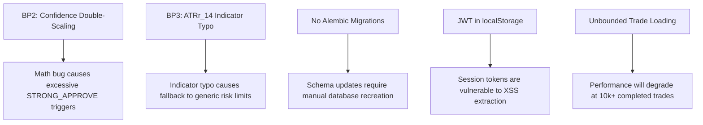

# Chapter 28: Technical Debt

## 📌 Purpose
This chapter documents the known limitations, design trade-offs, and technical debt in the NEXUS platform. Maintaining a transparent register of engineering compromises ensures that future contributors can plan refactoring work effectively and avoid compounding existing issues.

---

## 🚫 Critical Technical Debt Register

### 1. ConfidenceEngine Double-Scaling Math Discrepancy (BP2)
* **Description**: A mathematical issue exists in the confidence score calculation pipeline within `core/confidence_engine.py`. When combining individual factor scores, the engine double-scales the outputs.
* **Impact**: The calculated confidence score is artificially inflated for almost all signals, causing them to return a status of `STRONG_APPROVE`. This bypasses the intermediate `APPROVE` and `REJECT` thresholds, reducing the effectiveness of the automated position-sizing reduction rules.
* **Workaround / Mitigation**: Temporarily managed by enforcing strict pre-flight manual reviews at the user interface layer. A complete mathematical refactor is scheduled for Sprint 24.

---

### 2. Volatility Indicator Pipeline Typo (BP3)
* **Description**: A typo exists in the technical indicator mapping within the data collector pipeline. The system references `ATRr_14` instead of the correct `ATR_14` field.
* **Impact**: The indicator pipeline fails to resolve the ATR value for certain asset queries, returning a default value of zero. This can cause the `PositionSizingEngine` to fall back to generic risk limits, reducing the accuracy of volatility-based stop-loss calculations.
* **Workaround / Mitigation**: Fixed temporarily by hardcoding fallback values in the `TPSLEngine`. A clean fix to correct the field name is scheduled for Sprint 24.

---

### 3. Missing Database Migration Framework
* **Description**: Schema migrations are managed manually. There is no automated database migration system (such as **Alembic**) configured in the repository.
* **Impact**: Modifying database models (`database.py`) in production is risky and error-prone. Altering tables requires manual SQL execution, which can lead to data schema discrepancies across environments.
* **Workaround / Mitigation**: Handled by recreating the SQLite database (`rm decision_engine.db && startup.py`) during development updates. Implementing Alembic is a P0 priority for Sprint 24.

---

### 4. Unsecured Token Storage (Local Storage)
* **Description**: User JWT session tokens are stored in the browser's `localStorage` rather than secure, HttpOnly cookies.
* **Impact**: The session token is vulnerable to extraction via Cross-Site Scripting (XSS) attacks if malicious scripts are successfully injected into the frontend.
* **Workaround / Mitigation**: Mitigated by enforcing strict Content Security Policies (CSP) in `index.html` to block unauthorized script execution. Migrating token storage to secure cookies is scheduled for Sprint 25.

---

### 5. Unbounded Memory Growth on Historical Trade Loading
* **Description**: The Portfolio Engine loads all completed trades into memory to compute performance metrics (Sharpe, Sortino, drawdowns).
* **Impact**: While acceptable for Alpha testing, this approach will degrade performance once the simulated database grows beyond 10,000+ completed trades, leading to slow page loads and high memory usage.
* **Workaround / Mitigation**: Managed temporarily by limiting the number of loaded trades via query filters. A permanent solution using paginated queries and incremental metric caching is scheduled for Sprint 25.

---

## 📊 Summary of Technical Debt

---

## 🔄 Future Extension Points
- **Automated Debt Tracking**: Future releases will track technical debt by parsing code comments (e.g. `# TODO:` or `# DEBT:`) during CI/CD test runs and publishing an updated summary report.

---

## 🔗 Related Chapters
- [Chapter 06: Database Architecture](06_DATABASE_ARCHITECTURE.md) - Database schema constraints.
- [Chapter 09: AI Decision Engine](09_AI_DECISION_ENGINE.md) - Context on the scoring and confidence math.
- [Chapter 29: System Roadmap](29_ROADMAP.md) - Remediation timelines for these issues.
