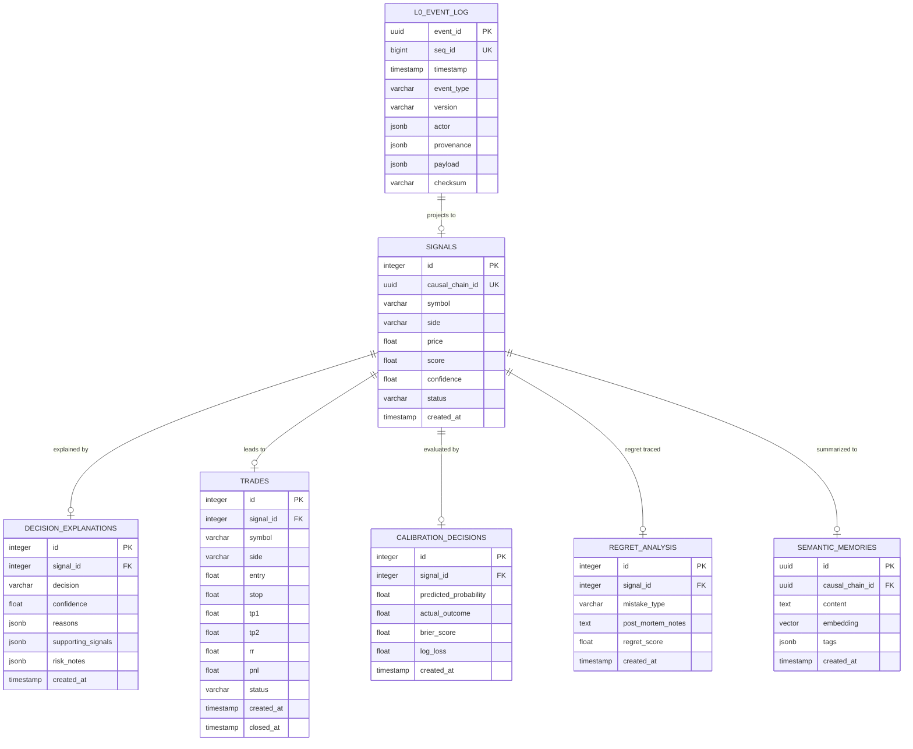

# NEXUS Memory: Tam Mimari Tasarım Dokümanı (v2.0)

> **Statü:** Taslak (CTO Onayı Bekliyor)
> **Sürüm:** 2.0.0-draft
> **Tarih:** Temmuz 2026
> **Yazar:** Jules (Principal Systems Architect)

---

## 1. Giriş ve Vizyon

**NEXUS Memory**, Elite Decision Engine'in karar alma, analiz, ticaret ve öğrenme döngülerindeki tüm veri akışını yöneten, yüksek performanslı, denetlenebilir (audit-ready), çok katmanlı ve zamansal çözünürlüğe sahip yeni nesil bellek mimarisidir.

Mevcut tek katmanlı `TradeMemory` / `JournalEntry` yapısı, yüksek frekanslı sinyal analizi, yapay zeka konseyi (AI Council) tartışma geçmişi, geçmiş kararların post-mortem pişmanlık analizleri (regret analysis) ve uzun vadeli anlamsal bellek (semantic memory) gereksinimlerini karşılamakta yetersiz kalmaktadır.

NEXUS Memory, veriyi ham olaylardan (events) yüksek seviyeli anlamsal çıkarımlara (semantic insights) kadar 4 farklı katmanda (L0 - L3) işleyerek ve aralarındaki nedensellik bağlarını (Provenance Model) koruyarak sistemin karar kalitesini sürekli optimize eder.

---

## 2. Çok Katmanlı Bellek Mimarisi (Multi-Layer Memory Model)

NEXUS Memory, veriyi en alt seviyedeki ham olay akışından en üst seviyedeki anlamsal kavramsal çıkarımlara doğru filtreleyen ve damıtan 4 katmandan oluşur.

```
┌──────────────────────────────────────────────────────────┐
│              L3: SEMANTIC LAYER                          │ (Vektör Tabanlı, RAG,
│  Long-term Memory, Lessons Learned, Embeddings           │  Öğrenilmiş Dersler)
└────────────────────────────▲─────────────────────────────┘
                             │ Vektörizasyon & Sentez
┌────────────────────────────┴─────────────────────────────┐
│              L2: DISTILLATION LAYER                      │ (Analitik ve Kalibrasyon,
│  ECE, Murphy Brier, Regret, Mistake Classification       │  Post-Mortem Değerlendirme)
└────────────────────────────▲─────────────────────────────┘
                             │ Periyodik/Tetiklemeli Analiz
┌────────────────────────────┴─────────────────────────────┐
│              L1: MATERIALIZED VIEWS & GRAPH              │ (İlişkisel Tablolar,
│  State Tables (Trades, Positions) & Causal Knowledge Graph│  Karar ve Bilgi Grafı)
└────────────────────────────▲─────────────────────────────┘
                             │ Projeksiyon & Dönüşüm (Real-time)
┌────────────────────────────┴─────────────────────────────┐
│              L0: APPEND-ONLY EVENT LOG                   │ (Yazma Yoğun, Değişmez,
│  Chronological Immutable Event Stream (System-of-Record) │  Zaman Damgalı Günlük)
└──────────────────────────────────────────────────────────┘
```

### 2.1. Layer 0 (L0): Append-only Event Log
* **Tanım:** Sistemin ana kayıt defteridir (System-of-Record). Elite Decision Engine içerisinde gerçekleşen her mikro olay (sinyal tespiti, konsey oylamaları, risk değerlendirmeleri, emir iletimleri, gerçekleşen işlemler ve piyasa güncellemeleri) buraya değişmez (immutable) ve kronolojik bir şekilde yazılır.
* **Özellikler:**
  - **Değişmezlik (Immutability):** Kaydedilen hiçbir olay değiştirilemez veya silinemez.
  - **Yazma Yoğun (Write-Heavy):** Yüksek throughput'lu yazma operasyonları için optimize edilmiştir.
  - **Zaman Sıralı (Chronological):** Her olay milisaniye hassasiyetinde zaman damgasına (`timestamp`) ve sıralı artan bir ID'ye sahiptir.
  - **Şema Esnekliği:** JSON formatında payload barındırır fakat her olay tipi için katı bir "Canonical Event Schema" uygulanır.

### 2.2. Layer 1 (L1): Materialized Views & Graph
* **Tanım:** L0 Event Log katmanındaki olayların, sistemin hızlı sorgulama ve operasyonel kararlar alabilmesi için projekte edildiği (materialized) ilişkisel tablolar ve nedensellik ilişkilerini tutan bilgi grafıdır (Knowledge Graph).
* **Özellikler:**
  - **İlişkisel Projeksiyonlar:** Aktif pozisyonlar (`Positions`), açık emirler (`Orders`), kullanıcı ayarları (`UserSettings`) ve anlık portföy durumu gibi ilişkisel tablolar, L0 olayları geldikçe gerçek zamanlı (veya mikro-batch) olarak güncellenir.
  - **Karar ve Bilgi Grafı (Causal Graph):** Sinyaller, Karar Açıklamaları (Decision Explanations), Konsey Kararları ve gerçekleşen İşlemler arasındaki "nedensel bağları" (çizgeleri) tutar. (Örn: "X Sinyali -> Y Konsey Kararı -> Z Karar Açıklaması -> T Trade" akışı).

### 2.3. Layer 2 (L2): Distillation Layer
* **Tanım:** Ham verilerin ve operasyonel durumların analitik olarak damıtıldığı (distilled) ve kalibre edildiği katmandır. Karar motorunun kendi kararlarını geriye dönük sorgulaması ve adaptif öğrenme (adaptive learning) gerçekleştirmesi burada çalışır.
* **Özellikler:**
  - **Kalibrasyon Analitiği:** Beklenen Kalibrasyon Hatası (Expected Calibration Error - ECE), Murphy Brier Skor Ayrışımı (Brier Score Decomposition) ve Log Kaybı (Log Loss) hesaplamaları.
  - **Post-Mortem Pişmanlık Analizi (Regret Analysis):** Kaçırılan fırsatların (False Negative) ve hatalı işlemlerin (False Positive) tespiti ve analizi.
  - **Hata Sınıflandırma Sicili (Mistake Classification Registry):** Kaybeden işlemlerin sistematik analiz ile sınıflandırılması (Örn: "Disiplinsizlik", "Kötü Risk Yönetimi", "Yetersiz Hacim", "Hatalı Sinyal").
  - **Asenkron Çalışma:** Bu katman ağır analitik hesaplamalar içerdiğinden ana işlem akışını engellememek için asenkron (asynchronous worker) veya periyodik cron işleri olarak çalışır.

### 2.4. Layer 3 (L3): Semantic Layer
* **Tanım:** Sistemde edinilen tecrübelerin, geçmiş işlemlerden çıkarılan derslerin (lessons learned) ve yapay zeka konseyi diyaloglarının uzun vadeli anlamsal bellek (long-term semantic memory) olarak saklandığı katmandır.
* **Özellikler:**
  - **Vektörizasyon (Embeddings):** Çıkarılan dersler ve piyasa koşulları vektör uzayına aktarılır (Örn: `text-embedding-3-small` veya yerel modeller).
  - **RAG (Retrieval-Augmented Generation) Entegrasyonu:** Yeni bir karar alınırken, mevcut piyasa koşullarına benzer geçmiş koşullardaki "Lessons Learned" ve "Trade Memories" anlamsal olarak aranır (Similarity Search) ve prompt kütüphanesine bağlam (context) olarak eklenir.
  - **Anlamsal Özetler:** İşlem bazlı mikro dersler, haftalık ve aylık makro anlamsal özetlere dönüştürülür.

---

## 3. Canonical Event Schema (L0 Şeması)

L0 Event Log katmanına yazılacak tüm olaylar aşağıdaki standart şemaya uymak zorundadır. Şema, her olay için kesin meta-veri (metadata), köken (provenance) bilgisi ve şifreleme/imza güvencesi sunar.

### 3.1. JSON Schema Tanımı (Pydantic Modeli Altyapısı)

```json
{
  "$schema": "http://json-schema.org/draft-07/schema#",
  "title": "NEXUSCanonicalEvent",
  "type": "object",
  "properties": {
    "event_id": {
      "type": "string",
      "format": "uuid"
    },
    "seq_id": {
      "type": "integer",
      "description": "Artan sıralı tekil numara"
    },
    "timestamp": {
      "type": "string",
      "format": "date-time"
    },
    "event_type": {
      "type": "string",
      "enum": [
        "SIGNAL_RECEIVED",
        "SIGNAL_FILTER_RESULT",
        "COUNCIL_DEBATE_STARTED",
        "COUNCIL_AGENT_VOTE",
        "COUNCIL_CONSENSUS_REACHED",
        "DECISION_EXPLANATION_GENERATED",
        "RISK_EVALUATION",
        "POSITION_SIZED",
        "ORDER_CREATED",
        "ORDER_FILLED",
        "ORDER_CANCELLED",
        "TRADE_OPENED",
        "TRADE_CLOSED",
        "CALIBRATION_CALCULATED",
        "REGRET_POST_MORTEM",
        "LESSON_EXTRACTED",
        "SYSTEM_ALERT"
      ]
    },
    "version": {
      "type": "string",
      "default": "1.0.0"
    },
    "actor": {
      "type": "object",
      "properties": {
        "id": { "type": "string" },
        "type": { "type": "string", "enum": ["SYSTEM", "AGENT", "USER", "EXTERNAL_API"] },
        "name": { "type": "string" }
      },
      "required": ["id", "type", "name"]
    },
    "provenance": {
      "type": "object",
      "properties": {
        "parent_event_id": { "type": ["string", "null"], "format": "uuid" },
        "causal_chain_id": { "type": "string", "format": "uuid" },
        "sources": {
          "type": "array",
          "items": { "type": "string" },
          "description": "Ham veri kaynakları, API URL'leri, indicator sürümleri"
        }
      },
      "required": ["causal_chain_id"]
    },
    "payload": {
      "type": "object",
      "description": "Olay tipine özel dinamik JSON verisi"
    },
    "checksum": {
      "type": "string",
      "description": "Event bütünlüğü için SHA-256 hash değeri (event_id + seq_id + timestamp + event_type + JSON(payload))"
    }
  },
  "required": ["event_id", "seq_id", "timestamp", "event_type", "version", "actor", "provenance", "payload", "checksum"]
}
```

### 3.2. Pydantic Python Tanımı

```python
from enum import Enum
from typing import Any, Optional, List
from pydantic import BaseModel, Field, UUID4
from datetime import datetime

class EventType(str, Enum):
    SIGNAL_RECEIVED = "SIGNAL_RECEIVED"
    SIGNAL_FILTER_RESULT = "SIGNAL_FILTER_RESULT"
    COUNCIL_DEBATE_STARTED = "COUNCIL_DEBATE_STARTED"
    COUNCIL_AGENT_VOTE = "COUNCIL_AGENT_VOTE"
    COUNCIL_CONSENSUS_REACHED = "COUNCIL_CONSENSUS_REACHED"
    DECISION_EXPLANATION_GENERATED = "DECISION_EXPLANATION_GENERATED"
    RISK_EVALUATION = "RISK_EVALUATION"
    POSITION_SIZED = "POSITION_SIZED"
    ORDER_CREATED = "ORDER_CREATED"
    ORDER_FILLED = "ORDER_FILLED"
    TRADE_OPENED = "TRADE_OPENED"
    TRADE_CLOSED = "TRADE_CLOSED"
    CALIBRATION_CALCULATED = "CALIBRATION_CALCULATED"
    REGRET_POST_MORTEM = "REGRET_POST_MORTEM"
    LESSON_EXTRACTED = "LESSON_EXTRACTED"

class ActorType(str, Enum):
    SYSTEM = "SYSTEM"
    AGENT = "AGENT"
    USER = "USER"
    EXTERNAL_API = "EXTERNAL_API"

class Actor(BaseModel):
    id: str
    type: ActorType
    name: str

class Provenance(BaseModel):
    parent_event_id: Optional[UUID4] = None
    causal_chain_id: UUID4
    sources: List[str] = Field(default_factory=list)

class CanonicalEvent(BaseModel):
    event_id: UUID4
    seq_id: int
    timestamp: datetime
    event_type: EventType
    version: str = "1.0.0"
    actor: Actor
    provenance: Provenance
    payload: dict[str, Any]
    checksum: str
```

---

## 4. Provenance Modeli (Nedensellik ve Köken Takibi)

NEXUS sisteminde "Açıklanabilirlik" (Explainability) en kritik ilkelerden biridir. Bir trade işleminin neden yapıldığını ya da bir sinyalin neden reddedildiğini geriye dönük tam doğrulukla sorgulayabilmek için **Provenance Modeli** uygulanır.

```
Ham Veri (Hyperliquid Ticks) ────────┐ (L0 Olay)
                                      ▼
                             [SIGNAL_RECEIVED]
                                      │ (parent_event_id)
                                      ▼
                           [SIGNAL_FILTER_RESULT]
                                      │ (parent_event_id)
                                      ▼
                         [COUNCIL_DEBATE_STARTED]
                                      │ (parent_event_id)
                                      ▼
                        [COUNCIL_CONSENSUS_REACHED]
                                      │ (parent_event_id)
                                      ▼
                     [DECISION_EXPLANATION_GENERATED]
                                      │ (parent_event_id)
                                      ▼
                              [RISK_EVALUATION]
                                      │ (parent_event_id)
                                      ▼
                              [POSITION_SIZED]
                                      │ (parent_event_id)
                                      ▼
                               [ORDER_CREATED]
                                      │ (parent_event_id)
                                      ▼
                                [TRADE_OPENED]
```

### Provenance İzleme Kuralları:
1. **Causal Chain ID:** Bir sinyal ilk kez sisteme girdiğinde yeni bir `causal_chain_id` üretilir. Bu zincire bağlı tüm alt olaylar (Konsey oylamaları, Risk kararları, Emirler, Pozisyon kapatma) aynı `causal_chain_id` değerini taşır. Bu sayede tek bir sorguyla sinyalin tüm yaşam döngüsü izlenebilir.
2. **Parent Event ID:** Her olay, kendisini doğrudan tetikleyen bir önceki olayın ID'sini `parent_event_id` olarak kaydeder. Bu, Event Log içinde bir Yönlü Döngüsüz Çizge (DAG) oluşturur.
3. **Sources:** Olay anında karar vermede kullanılan harici verilerin durumları (Örn: "BTC Fiyatı = 62500, Funding Rate = 0.0001, RSI_1h = 65") bu alanda kaynak ve sürüm bazlı (version-controlled sources) olarak listelenir.

---

## 5. ER Diyagramı (İlişkisel ve Bilgi Grafı Yapısı)

Aşağıdaki Mermaid ER şeması, L0 Event Log tablosu ile L1 Materialized tabloları, L2 Analitik tabloları ve L3 Vektör Bellek yapıları arasındaki tam entegrasyonu göstermektedir.



---

## 6. Sınıf Sınırları ve Klasör Yapısı

NEXUS Memory modülü, kod tabanında temiz bir modülerlik sağlamak amacıyla `memory/` dizini altında katmanlı bir şekilde yapılandırılacaktır.

```
memory/
│
├── __init__.py
├── trade_memory.py               # Geriye dönük uyumluluk katmanı (Legacy wrapper)
│
├── core/
│   ├── __init__.py
│   └── manager.py                # NEXUSMemoryManager (L0-L3 koordinasyonu)
│
├── l0_event_log/
│   ├── __init__.py
│   ├── models.py                 # SQLAlchemy/SQLite EventLog şeması
│   ├── service.py                # EventLog append, read, checksum doğrulama
│   └── schemas.py                # Pydantic Canonical Olay tanımları
│
├── l1_materializer/
│   ├── __init__.py
│   ├── projection.py             # Event dinleyicileri ve L1 tablolara aktarım
│   └── graph_service.py          # Nedensellik Çizgesi (Causal Graph) sorgulama
│
├── l2_distillation/
│   ├── __init__.py
│   ├── calibration_engine.py     # ECE, Murphy Brier, Log Loss hesaplama
│   ├── regret_analyzer.py        # Post-mortem regret ve mistake classification
│   └── worker.py                 # Asenkron arka plan görevleri
│
└── l3_semantic/
    ├── __init__.py
    ├── vector_service.py         # Embedding oluşturma ve benzerlik araması
    └── memory_injector.py        # LLM prompt bağlamı hazırlama (Context Builder)
```

---

## 7. API Tasarımı ve Dahili Python Arayüzleri

### 7.1. Dahili Python Sınıf Arayüzleri

#### 1. NEXUSMemoryManager (Ana Orkestratör)
```python
class NEXUSMemoryManager:
    """NEXUS Memory katmanlarının (L0-L3) tek bir arayüzden yönetilmesini sağlayan ana sınıf."""

    def __init__(self, db_session_factory, vector_client=None):
        self.l0 = L0EventLogService(db_session_factory)
        self.l1 = L1MaterializerService(db_session_factory)
        self.l2 = L2DistillationService(db_session_factory)
        self.l3 = L3SemanticService(vector_client)

    async def record_event(
        self,
        event_type: EventType,
        payload: dict[str, Any],
        actor: Actor,
        provenance: Provenance
    ) -> UUID4:
        """L0'a yeni bir olay ekler, L1 projeksiyonunu tetikler."""
        # 1. CanonicalEvent ve Checksum oluştur
        # 2. L0'a yaz
        # 3. L1 Materializer'ı tetikle (asenkron / senkron)
        pass

    async def get_provenance_chain(self, causal_chain_id: UUID4) -> list[dict[str, Any]]:
        """Verilen nedensellik zincirindeki tüm olayları kronolojik sırayla getirir."""
        pass
```

#### 2. L2 Distillation Engine (Analitik Kalibrasyon)
```python
class L2DistillationService:
    """Pişmanlık ve kalibrasyon hesaplamalarını yürüten servis."""

    def calculate_brier_decomposition(self, symbol: Optional[str] = None) -> dict[str, float]:
        """Brier Skoru'nu Güvenilirlik, Keskinlik ve Belirsizlik bileşenlerine ayırır."""
        pass

    def perform_post_mortem(self, trade_id: int, mistake_type: str, notes: str) -> bool:
        """Tamamlanan bir işlemi analiz eder, pişmanlık skorunu kaydeder ve L3'ü tetikler."""
        pass
```

#### 3. L3 Semantic Memory (Anlamsal Hafıza ve Prompt Enjeksiyonu)
```python
class L3SemanticService:
    """Vektör tabanlı hafıza sorguları ve LLM Prompt entegrasyonu."""

    def generate_lessons_context(self, symbol: str, current_market_regime: str) -> str:
        """Yeni bir sinyal analiz edilirken LLM prompt'una enjekte edilecek bağlamı üretir."""
        # Benzer market regime ve sembol geçmişindeki L3 Lessons Learned kayıtlarını bulur.
        pass
```

### 7.2. FastAPI REST Endpoint Tasarımı (`api/routes/nexus_memory.py`)

Geliştirilecek yeni REST uç noktaları, arayüzde yüksek performanslı analiz ve grafik sunumu için tasarlanmıştır.

```
GET    /api/v1/nexus/memory/events           # L0 olay listesi (filtreler: event_type, causal_chain_id)
GET    /api/v1/nexus/memory/provenance/{id}   # Causal Chain veya Event ID üzerinden köken haritası (Graph formatı)
POST   /api/v1/nexus/memory/distill/run      # L2 analitik hesaplamalarını manuel tetikleme
GET    /api/v1/nexus/memory/calibration      # ECE, Murphy Brier ve Log Loss istatistikleri
POST   /api/v1/nexus/memory/post-mortem      # Tamamlanan işlem sonrası hata sınıflandırma ve not ekleme
GET    /api/v1/nexus/memory/lessons          # L3'te saklanan derslerin anlamsal araması (Query param: q)
```

#### Örnek Response: `GET /api/v1/nexus/memory/provenance/e54b67-4a0b-47e2-a05e-85`
```json
{
  "causal_chain_id": "e54b67-4a0b-47e2-a05e-85c96328a6f3",
  "nodes": [
    { "id": "ev-101", "type": "SIGNAL_RECEIVED", "label": "BTC Long Signal @ $63,200", "timestamp": "2026-07-15T12:00:00Z" },
    { "id": "ev-102", "type": "COUNCIL_CONSENSUS_REACHED", "label": "Council Approved (75% Confidence)", "timestamp": "2026-07-15T12:00:05Z" },
    { "id": "ev-103", "type": "RISK_EVALUATION", "label": "Risk Engine: OK (Max exposure 2.5%)", "timestamp": "2026-07-15T12:00:06Z" },
    { "id": "ev-104", "type": "ORDER_FILLED", "label": "Order Filled #HL-99812", "timestamp": "2026-07-15T12:00:08Z" }
  ],
  "edges": [
    { "source": "ev-101", "target": "ev-102", "relation": "debated_in" },
    { "source": "ev-102", "target": "ev-103", "relation": "risk_checked_by" },
    { "source": "ev-103", "target": "ev-104", "relation": "executed_to" }
  ]
}
```

---

## 8. Geçiş ve Geçiş Planı (Migration Plan)

Mevcut sistemi kesintiye uğratmadan ve veri kaybı yaşamadan NEXUS Memory yapısına geçmek için **3 Aşamalı Geçiş Stratejisi** uygulanacaktır:

### Aşama 1: Çift Yazma (Double-Write) ve Legacy Wrapper (Geriye Dönük Uyumluluk)
* Mevcut `JournalEntry` tablosu korunur.
* `trade_memory.py` içerisindeki `TradeMemory` sınıfı, yeni `NEXUSMemoryManager`'ı sarmalayan (wrap eden) bir yapıya dönüştürülür.
* Sinyal tetiklendiğinde sistem hem `JournalEntry` tablosuna klasik yazım yapar hem de arka planda L0 Event Log'a `SIGNAL_RECEIVED` ve `TRADE_OPENED` olaylarını yazar.
* Bu aşamada hata durumunda legacy kod ana işlem akışını kesmez (soft failback).

### Aşama 2: Geriye Dönük Veri Göçü (Backfill Script)
* Mevcut tüm `JournalEntry`, `Signal`, `Trade` ve `PaperTrade` verilerini okuyup sırasıyla L0 Event Log formatına dönüştüren bir asenkron göç betiği (`scripts/migrate_to_nexus_memory.py`) yazılır.
* Geçmiş her bir trade için yapay bir `causal_chain_id` ve kronolojik olay dizisi üretilerek L0 Event Log'a yazılır ve bütünlük sağlamak için SHA-256 imzaları hesaplanır.

### Aşama 3: Tam Geçiş ve Temizlik (Cutover)
* Sistem okuma ve sorgulama operasyonlarında tamamen yeni NEXUS Memory katmanlarına (L1, L2, L3) yönlendirilir.
* Çift yazma sonlandırılır. `JournalEntry` tablosu deprecate edilerek veritabanından kaldırılır (veya arşivlenir).
* `TradeMemory` sınıfı tamamen kaldırılarak doğrudan `NEXUSMemoryManager` entegrasyonuna geçilir.

---

## 9. CTO Değerlendirme ve Onay

NEXUS Memory'nin bu mimari tasarımı, Elite Decision Engine'in karar kalitesini matematiksel olarak kalibre edebilen, her kararın arkasındaki nedenselliği şüpheye yer bırakmayacak şekilde takip edebilen ve tecrübelerden öğrenebilen akıllı bir sisteme dönüşmesi için tasarlanmıştır.

Bu tasarım onaylandıktan sonra büyük kod geliştirmelerine (L0 veri tabanı şemalarının oluşturulması, L1 projeksiyon tetikleyicilerinin yazılması ve L2/L3 algoritmalarının implementasyonu) başlanacaktır.

**Onay Durumu:** [ ] ONAYLANDI  |  [ ] REVİZYON İSTENİYOR
**Tarih:** _________________
**CTO İmza:** _________________
